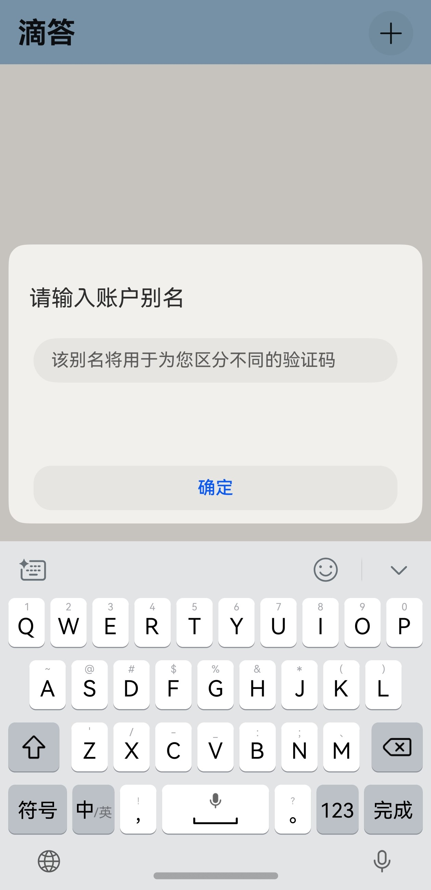

# TickAuth

使用 ArkTS 语言开发的实现获取 TOTP 验证码的**原生鸿蒙应用**，使您安全、便捷地获取动态验证码

## 注意：

1. **最低API要求**：API 12（5.0.0.102）
2. **下载建议**：建议从 AppGallery 下载（目前还未上架，正在申请软件著作权），若使用 DevEco Studio 安装则必须保持开发者模式开启，否则应用无法运行

## 安装指南：

### 方法一：从源码构建安装
1. 在电脑上下载 [DevEco Studio](https://developer.huawei.com/consumer/cn/download/)，并按照提示完成安装
2. 下载该项目所有文件，并**将项目用 DevEco Studio 打开**

```bash
git clone https://github.com/conradsheeran/TickAuth.git
```

3. 在手机上打开设置 - 系统 - 开发者选项 - **开发者模式** - **USB 调试**，并将其连接至电脑，保证其能被 DevEco Studio 识别
4. 使用 DevEco Studio 对应用完成 [自动签名](https://developer.huawei.com/consumer/cn/doc/harmonyos-guides-V5/ide-signing-V5)
5. 构建运行程序（Shift + F10）

### 方法二：从已编译的 Hap 应用包安装

1. 从 [Release](https://github.com/conradsheeran/TickAuth/releases) 中下载 Hap 应用包
2. 使用 [Auto-Installer](https://github.com/likuai2010/auto-installer.git) 根据提示完成安装

## 开发计划：

- [x] ~~完成 TOTP 验证码生成的后端开发~~
- [x] ~~完成基本 UI 界面的开发~~
- [x] ~~完成设置页面的开发（增加用户认证（例如面容、指纹等）功能）~~
- [x] ~~实现倒计时动画~~
- [x] ~~支持对密钥的导出与导入~~
- [ ] 使用华为账号实现云端同步
- [ ] 支持添加 Steam 令牌
- [ ] 增加对平板、可穿戴设备的支持

## 屏幕截图：

|                                         |                                   |
|-----------------------------------------|-----------------------------------|
|  |  |